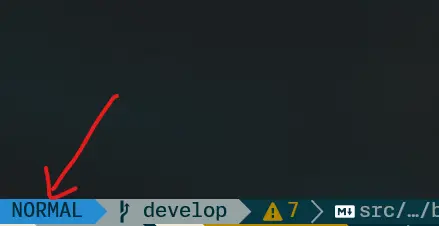
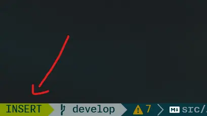
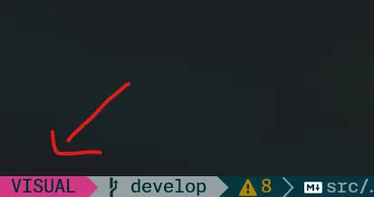
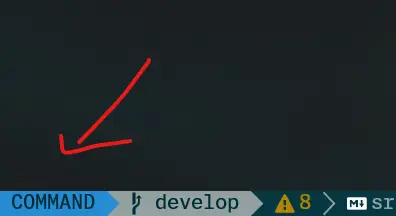
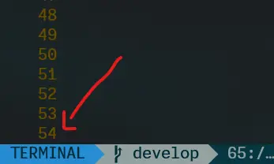

## ¿Qué es neovim?

Neovim es un editor de texto que se ejecuta en la terminal, es una versión mejorada de vim, con el fin de mejorar la experiencia de usuario y la facilidad de mantenimiento. Muy, pero muy **rápido**. Hay muchas personas y me incluyo, que dicen **_"Una vez pruebas neovim, no hay vuelta atrás"_**.

Es un editor de texto muy potente, con muchas funcionalidades, pero no te preocupes, no necesitas saberlas todas para poder usarlo, con el tiempo las irás aprendiendo. Además, puedes personalizarlo a tu gusto, con plugins, temas, etc.

Para poder usar neovim, primero debes instalarlo, puedes ver como hacerlo en el siguiente [enlace](https://www.neovim.io/). Esto instalará neovim totalmente limpio, sin ningún plugin, ni nada, solo el editor. Configurar neovim es otro mundo totalmente diferente. Pero puedes optar por usar [LazyVim](https://www.lazyvim.org/), que es una configuración de neovim, que viene con plugins, temas, etc. Así te ahorrarás mucho tiempo de configuraciónes y puedes pasar directamente a usarlo. También hay muchas otras configuraciones, pero yo te recomiendo `LazyVim` para empezar a familiarizarte. Esta es mi configuración de neovim, por si quieres verla: [My nvim setup](https://github.com/rxtsel/nvim).

Puede ser que te sientas un poco perdido al usarlo, pero no te preocupes, aquí te enseñaré algunos comandos básicos para que puedas usarlo.

## Modos de neovim

Debe saber que neovim tiene diferentes modos, que son:

- **Modo normal:** Es el modo por defecto, en el que puedes navegar por el documento, copiar, pegar, cortar, etc.
- **Modo insertar:** Es el modo en el que puedes escribir en el documento.
- **Modo visual:** Es el modo en el que puedes seleccionar texto.
- **Modo comando:** Es el modo en el que puedes ejecutar comandos.
- **Modo terminal:** Es el modo en el que puedes ejecutar comandos de la terminal.

Yo tengo un plugin que me muestra en que modo estoy, pero si tu no lo tienes, puedes verlo en la esquina inferior izquierda, te mostrará el modo en el que estás:

- Modo normal: 
- Modo insertar: 
- Modo visual: 
- Modo comando: 
- Modo terminal: 

## Comandos

### Básicos:

| Comando      | Descripción                                                    |
| ------------ | -------------------------------------------------------------- |
| **i**        | Entrar a modo `Instert`                                        |
| **Esc**      | Salir de cualquier modo y entrar a modo `Normal`               |
| **v**        | Entrar a modo `Visual`                                         |
| **:**        | Entrar a modo `Comando`                                        |
| **o**        | Crea una nueva línea abajo del cursor y entra a modo `Insert`  |
| **O**        | Crea una nueva línea arriba del cursor y entra a modo `Insert` |
| **zz**       | Centra el cursor en la pantalla                                |
| **u**        | Deshacer cambios                                               |
| **Ctrl + r** | Rehacer cambios                                                |
| **:q**       | Salir de neovim                                                |
| **:w**       | Guardar cambios                                                |
| **:wq**      | Guardar cambios y salir de neovim                              |

### Navegación:

| Comando      | Descripción                                                      |
| ------------ | ---------------------------------------------------------------- |
| **h**        | Mover el cursor hacia la izquierda                               |
| **j**        | Mover el cursor hacia abajo                                      |
| **k**        | Mover el cursor hacia arriba                                     |
| **l**        | Mover el cursor hacia la derecha                                 |
| **0**        | Mover el cursor al inicio de línea                               |
| **$**        | Mover el cursor al final de línea                                |
| **%**        | Mueve el cursor al siguiente par de caracteres, como: (), {}, [] |
| **Ctrl + e** | Scroll hacia abajo                                               |
| **Ctrl + y** | Scroll hacia arriba                                              |
| **gg**       | Mover el cursor al inicio del documento                          |
| **G**        | Mover el cursor al final del documento                           |
| **w**        | Mover el cursor al inicio de la siguiente palabra                |
| **b**        | Mover el cursor al inicio de la palabra anterior                 |
| **e**        | Mover el cursor al final de la siguiente palabra                 |
| **Ctrl + u** | Desplace la pantalla varias líneas hacia arriba                  |
| **Ctrl + d** | Desplace la pantalla varias líneas hacia abajo                   |

### Convergencia:

| Comando | Descripción                         |
| ------- | ----------------------------------- |
| **veU** | Convierte a mayúsculas la selección |
| **veu** | Convierte a minúsculas la selección |

### Operaciones:

| Comando | Descripción                           |
| ------- | ------------------------------------- |
| **4j**  | Mover el cursor 4 líneas hacia abajo  |
| **6k**  | Mover el cursor 6 líneas hacia arriba |

- Puedes usar cualquier número y haccia cualquier dirección.

### Selección de texto:

| Comando | Descripción                                                                                                            |
| ------- | ---------------------------------------------------------------------------------------------------------------------- |
| **viw** | Selecciona la palabra bajo el cursor                                                                                   |
| **vec** | Reemplaza desde donde está el cursor hasta el final de la la palabra, queda en modo `Insert`                           |
| **ciw** | Reemplaza la palabra bajo el cursor, queda en modo `Insert`                                                            |
| **yiw** | Copia la bajo el cursor                                                                                                |
| **diw** | Borra la palabra bajo el cursor, queda en modo `Normal`                                                                |
| **vi(** | Selecciona el contenido entre paréntesis. (Funciona con cualquier par de carácter)                                     |
| **ci"** | Reemplaza el contenido entre comillas, queda en modo `Insert`. (Funciona con cualquier par de carácter)                |
| **va(** | Selecciona el contenido entre paréntesis y los paréntesis. (Funciona con cualquier par de carácter)                    |
| **da(** | Borra el contenido entre paréntesis y los paréntesis, queda en modo `Normal`. (Funciona con cualquier par de carácter) |
| **ca"** | Reemplaza el contenido entre comillas y las comillas, queda en modo `Insert`. (Funciona con cualquier par de carácter) |

### Copiar, pegar y cortar:

| Comando | Descripción                                                       |
| ------- | ----------------------------------------------------------------- |
| **yy**  | Copia la línea bajo el cursor                                     |
| **dd**  | Corta la línea bajo el cursor                                     |
| **p**   | Pega lo que está en el portapapeles en la linea abajo del cursor  |
| **P**   | Pega lo que está en el portapapeles en la linea arriba del cursor |
| **x**   | Corta el carácter bajo el cursor                                  |
| **vy**  | Copia el carácter bajo el cursor                                  |

### Buscar y reemplazar:

| Comando            | Descripción                                                                                         |
| ------------------ | --------------------------------------------------------------------------------------------------- |
| **/**              | Busca la palabra que escribas en todo el documento                                                  |
| **n**              | Busca la siguiente ocurrencia                                                                       |
| **N**              | Busca la ocurrencia anterior                                                                        |
| **fh**             | Busca la primera ocurrencia después del cursor para la letra `h`. (Funciona con cualquier carácter) |
| **Fh**             | Busca la primera ocurrencia antes del cursor para la letra `h`. (Funciona con cualquier carácter)   |
| **r**              | Reemplaza el carácter bajo el cursor por el carácter que indiques                                   |
| **#**              | Busca la palabra bajo el cursor                                                                     |
| **\***             | Busca la palabra bajo el cursor                                                                     |
| **:%s/aaa/bbbb/g** | Reemplaza todas las ocurrencias de `aaa` por `bbb` en todo el documento                             |

## ¡Listo, con estos comandos básicos puedes desenvolverte muy bien en Neovim. Que los disfrutes!. 😃
